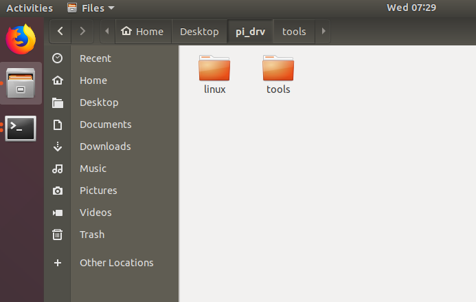
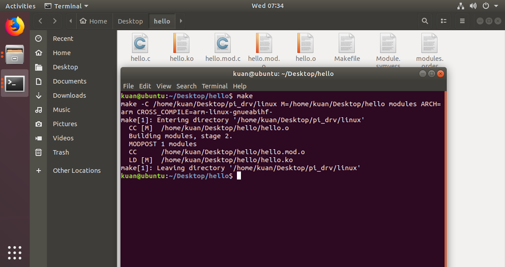
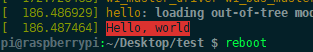

# nfc_id_copy
基于RC522硬件和树莓派3B+做的复制ID卡的驱动

## 1.概述

基于RC522的[硬件模块](https://item.taobao.com/item.htm?spm=a230r.1.14.241.3b7064adTrNnn8&id=557141693021&ns=1&abbucket=12#detail) 基于 树莓派3B+做的linux 驱动，通过控制命令进行ID复制
，[官方地址](https://www.raspberrypi.org/downloads/raspberry-pi-desktop/)。

文件夹构成

文件夹 | 说明 
-|-
01_doc | 一些关于rc522资料说明
02_drv |  使用驱动
03_test | 测试驱动文件夹
04_misc | 杂项文件夹，放一些图片之类

## 2.正文

> 材料需要 : 一个树莓派，一个RC522模块
> 环境需要 : [乌班图18.04 64位](https://ubuntu.com/download/desktop)
> 推荐编辑器 **source in sight4** 修改驱动代码 ， **xshell** 连接树莓派，利用xshell 自带的**xftp** 进行从PC上传输驱动.ko文件给树莓派进行安装运行 

- 1. 首先使用 02_drv驱动之前要知道自己树莓派安装版本

推荐  [**Debian Stretch with Raspberry Pi Desktop**](https://www.raspberrypi.org/downloads/raspberry-pi-desktop/) 固件,安装好后进行SSH连接(推荐使用XSHELL)

```bash 
pi@raspberrypi:~ $ uname -a
Linux raspberrypi 4.19.57-v7+ #1244 SMP Thu Jul 4 18:45:25 BST 2019 armv7l GNU/Linux
```

根据版本我们知道目前安装的版本是**4.19** 可能

所以我们需要树莓派对应版本的linux源码和对应的工具链

说明 | github地址 | 码云地址 | 备注
-|-|-|-
树莓派linux源码 | [github](https://github.com/raspberrypi/linux)  | [gitee](https://gitee.com/kuana/linux) | 树莓派Linux源码待编译使用
树莓派linux工具链| [github](https://github.com/raspberrypi/tools)  | [gitee](https://gitee.com/kuana/tools) | 树莓派Linux编译工具链，交叉编译编译源码要使用特定的gcc

```bash 
#其中linux版本根据 uname -a 下载指定版本
git clone --depth=1 https://gitee.com/kuana/tools.git
git clone --depth=1 --branch rpi-4.19.y https://gitee.com/kuana/linux.git
```


- 2. 设置环境

```bash 
# 设置环境  sudo gedit ~/.bashrc    打开文本后添加下行命令
export PATH=$PATH:$HOME/Desktop/pi_drv/tools/arm-bcm2708/gcc-linaro-arm-linux-gnueabihf-raspbian-x64/bin
#更新环境变量设置
source ~/.bashrc
#测试是否加入
kuan@ubuntu:~/Desktop/pi_drv$ arm-linux-gnueabihf-gcc -v
Using built-in specs.
COLLECT_GCC=arm-linux-gnueabihf-gcc
COLLECT_LTO_WRAPPER=/home/kuan/Desktop/pi_drv/tools/arm-bcm2708/gcc-linaro-arm-linux-gnueabihf-raspbian-x64/bin/../libexec/gcc/arm-linux-gnueabihf/4.8.3/lto-wrapper
#检查交叉编译GCC位置
kuan@ubuntu:~/Desktop/pi_drv$ which arm-linux-gnueabihf-gcc
/home/kuan/Desktop/pi_drv/tools/arm-bcm2708/gcc-linaro-arm-linux-gnueabihf-raspbian-x64/bin/arm-linux-gnueabihf-gcc
```

- 3. 测试是否可以导入驱动

进入 03_test/hello 文件夹 进行make编译



将编译好的 hello.ko 通过 xftp 传输到 树莓派中，进行安装

```bash 
sudo insmod hello.ko
```


## 3.参考

网址 | 说明 
-|-
[树莓派3b+安装Raspbian系统](https://www.jianshu.com/p/467335f07e05)| 树莓派刷入固件教程
[树莓派-底层开发](https://blog.csdn.net/shanglin163/article/details/88828427) | 树莓派Linux基本搭建，按照步骤做就可以调通
